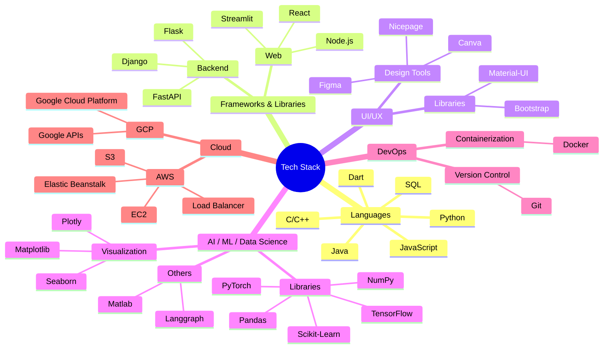

### Hello World! 

Hi, I'm Priya 👩‍💻 — a dual-degree IT student at ABV-IIITM Gwalior.

- 🔭 I’m a web developer, student researcher and a competitive programmer
- 🌱 I’m exploring NLP, DSA and Agentic AI
- 💬 Ask me about making chatbots, ML model fine-tuning, or automation. 
- 😄 Pronouns: She / Her  
- ⚡ Fun fact: I speak as many languages as I code in.
- 🌐 You can check out my [portfolio website](https://pri2k.github.io/Portfolio)

---

## 🧠 Tech Stack

